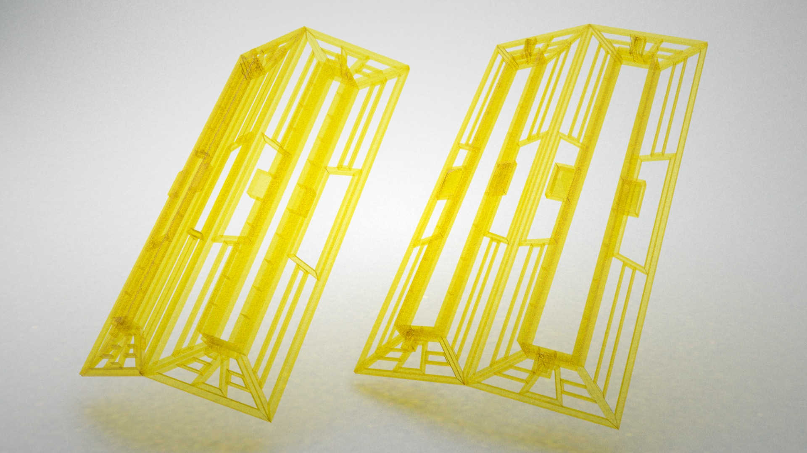
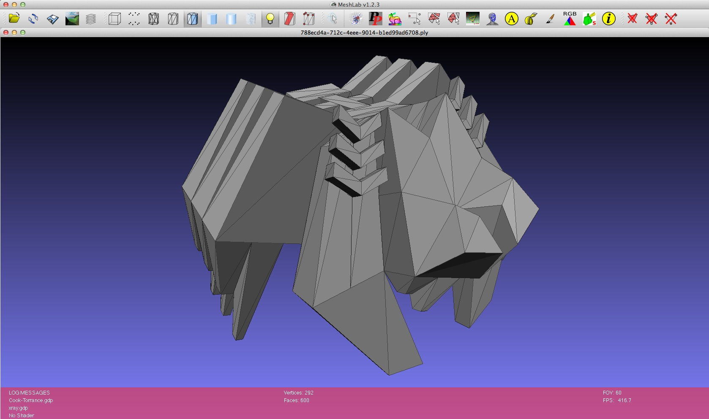

# DevArt Co(de)Factory


Photo credit: [Andrew Meredith](http://meredithphoto.com)

This project was commissioned by Google & Barbican as part of [DevArt](http://devart.withgoogle.com) at the [Digital Revolutions](http://www.barbican.org.uk/digital-revolution) exhibition.

Visit [devartcodefactory.com](http://devartcodefactory.com) to view the live project, [learn more about it](http://devartcodefactory.com/#/about), [browse the online gallery](http://devartcodefactory.com/#/gallery) and create your own piece...

This repository contains all source code and relevant assets created between January - August 2014, which I hope might be valuable for others interested in studying a complete & non-trivial Clojure/ClojureScript project (6200+ LOC). Furthermore, this project serves as the first public realworld use case of the various libraries of the [thi.ng](http://thi.ng) collection. You're very welcome to submit bug fixes & patches, but this release is primarily meant for educational purposes.

## Building this project

### Module overview

The project uses multiple source folders to group its various modules:

#### /assets

Contains sketches, screenshots, renders, 3d models and technical drawings created during development. The `/lcd` subdir contains the [Fritzing](http://fritzing.org) source file for the daisy chaining LCD PCB, controlled via Raspberry PI. Use Fritzing to re-generate the PCB fabrication files.

#### /src-cljs

This folder contains the entire frontend source code, written in ClojureScript. It requires no 3rd party libraries apart from those listed (and automatically downloaded by Leiningen) in `project.clj`. The main application and entry point is in the `codefactory.app` namespace.

The frontend is a single page application and makes heavy use of [core.async's](https://github.com/clojure/core.async) pub-sub bus/mechanism to deal with event handling and communicate between its various modules. Each module stores its state in a local atom. Furthermore, there's an extensive configuration to customize module & routing behavior. See `codefactory.config` namespace for further details.

At the heart of the app's functionality are two libraries: [thi.ng/geom](http://thi.ng/geom) & [thi.ng/morphogen](http://thi.ng/morphogen). All WebGL related functionality is provided by the [geom-webgl](https://github.com/thi-ng/geom/blob/develop/geom-webgl/src/index.org) module, whereas the actual shape operations are realized by the Morphogen DSL on top of the geom-core libs.

#### /src-fabricate

This folder contains a complete Leiningen project and the source code to generate 3d models & render scenes (for [LuxRender](http://luxrender.net)) of the physical exhibit plan, as well as the generator for the 446 3D printed tiles used to create the 2.4 x 3.0 metres large flute structure and the cladding for the plinths holding the Nexus 10 tablets in the gallery. These structures are created from a 2D bezier curve used as lathe to form a tubular quad mesh, and each quad then taken as seed for a Morphogen shape transformation, using only the same 8 shape operations as offered by the Web UI. The generated 3D STL files and technical drawings for these structures are located in the `/assets` folder.




#### /src-gae

Contains the complete Clojure backend and wrapper for the Google AppEngine API & core services. The main app itself is written as a standard [Ring](https://github.com/ring-clojure/ring) handler using [Compojure](https://github.com/weavejester/compojure). The AppEngine wrapper started out using some ideas & snippets from the outdated [appengine-magic](https://github.com/gcv/appengine-magic) project, but ended up differing quite substantially and might be developed further...

At the heart of the backend is a simple REST style API, which supports both JSON and [EDN](https://github.com/edn-format/edn) formats (though the web UI is only using EDN, since it's native to Clojure). Each API handler defines a number of validators which are defined in this file: `/src-gae/codefactory/config.clj` and executed via the [thi.ng/validate](http://thi.ng/validate) library (similarily this library is also used by the frontend router).

3D objects created with the Co(de)Factory UI are only defined & stored as abstract syntax trees (ASTs). However, as part of the object submission process, the backend is generating 3D STL files of the uploaded code structures (ASTs) and uses the [geom-svg](https://github.com/thi-ng/geom/blob/develop/geom-svg/src/index.org) module to render 3D SVG previews and [thi.ng/luxor](http://thi.ng/luxor) to create a render scene bundle incl. camera, lights & materials for LuxRender. Only selected objects will receive an HD LuxRender-rendered asset (generated on Google Compute Engine instances), which will be featured on the website's homepage. All generated assets can be downloaded via these REST API handlers:

```bash
curl -X GET http://devartcodefactory.com/api/1.0/objects/{{OBJECT-UUID}}/stl > foo.stl
curl -X GET http://devartcodefactory.com/api/1.0/objects/{{OBJECT-UUID}}/preview > foo.svg
curl -X GET http://devartcodefactory.com/api/1.0/objects/{{OBJECT-UUID}}/lux > foo.zip
```

Example SVG render & Luxrendered version of piece submitted by Mathew Boor:

| SVG   | Luxrender   |
| ----- | ----------- |
|  |  |

Here's also an example how to use the API to download the AST of an object and use it with Morphogen from the REPL to generate a PLY mesh file:

```clojure
(ns user
  (:require
    [thi.ng.morphogen.core :as mg]
    [clj-http.client :as http]
    [clojure.edn :as edn]))

(def base-url "http://devartcodefactory.com/api/1.0/objects/")

(defn codefactory-ply-mesh
  "Downloads AST for given object UUID and saves PLY mesh in project root dir.
  Note: This example only works for objects with box seeds (for brevity)."
  [id]
  (let [response (http/get (str base-url id) {:accept "application/edn"})
        body     (edn/read-string (:body response))
        ast      (get-in body [:body :tree])]
    (mg/save-mesh (mg/seed-box 1) ast (str id ".ply"))))

(codefactory-ply-mesh "788ecd4a-712c-4eee-9014-b1ed99ad6708")
```



Amazing object submitted by Dianne N., transformed from a single cube...

#### /src-html

The source versions of the various HTML files used for the online version, Barbican gallery kiosks & workshops run with teenagers as part of Google & Barbican's Young Creators initiative. There're only minor differences between each version (mainly config settings). All development is supposed to only happen with the `staging.html` file and then changes applied to others later.

#### /src-less

All stylesheets used by the webapp, defined using LESS. The file `minxins.less` contains various reusable snippets.

#### /src-rpi

Python source code for the Raspberry PI to control the DMX gallery lighting & LCD panels displaying object credits.

### Build requirements

* Google AppEngine 1.9.8
* Java 1.7
* Leiningen 2.4.0
* Clojure 1.6.0
* ClojureScript 0.0-2280
* lein-cljsbuild 1.0.3
* NPM 1.4.x
* Grunt 0.4.x

### Running locally

```bash
cd devart-codefactory

# download & install AppEngine dependencies into local /lib dir
./install-dependencies.sh

# install grunt dependencies
npm install

# build & compress HTML & CSS
grunt prod

# compile ClojureScript/JS app
lein do cljsbuild clean, cljsbuild once prod

# launch AppEngine dev server
./launch.sh
```

> Note: `install-dependencies.sh` first uses Leining to download all required dependencies and then copies the required jar files from your local Maven repo into this dir: `/war/WEB-INF/lib`. It assumes the local Maven repo cache (used by Leiningen) is the default `~/.m2/repository`. If that's not the case, please edit the path first before running the script...

Then open your browser and navigate to [http://localhost:8080/staging/](http://localhost:8080/staging/)

If you end up hacking the ClojureScript source (in `/src-cljs`) and want (almost) instant automatic recompilation, open a separate terminal and use this invocation of `cljsbuild` instead:

```bash
lein do cljsbuild clean, cljsbuild auto dev
```

Likewise, for HTML/LESS editing, it's recommended to use the `grunt` default target, which will autocompile changes into the staging directory...

#### Google API key

The backend generates an unique URL for each submitted piece, which due to the nature of UUIDs is not human readable. Therefore the API handler responsible makes use of Google's `goo.gl` URL shortener to create shorter versions, but requires a valid Google API key to do so. This key needs to be inserted at the bottom of the `/src-gae/codefactory/config.clj` file before launching the server. You can run the app without such a key, though in this case your objects can of course only be accessed via their original long URL.

## License

The source code of this project is licensed under the [Apache Software License 2.0](http://www.apache.org/licenses/LICENSE-2.0).

All non-code assets are published under the [Creative Commons Attribution-NonCommercial license](http://creativecommons.org/licenses/by-nc/4.0).

&copy; 2014 Karsten Schmidt
